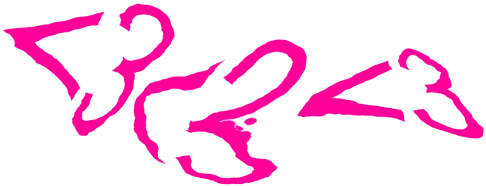

<!--
                              __
                     /\    .-" /
                    /  ; .'  .' 
                   :   :/  .'   
                    \  ;-.'     
       .--""""--..__/     `.    
     .'           .'    _   \   
    /                    \   ;  
   :                  \      :  
 .-;        -.         `.__.-'  
:  ;          \     ,   ;       
'._:           ;   :   (        
    \/  .__    ;    \   `-.     
     ;     "-,/_..--"`-..__)    
     '""--.._:
-->
# liquidPNG

LiquidPNG is an online tool designed for exploring text and image distortion. I started it as part of an ongoing project translating electronic data into physical form, but it kind of grew into a technical challenge around designing a web application.

Run it [here :^)](https://alexlafetra.github.io/liquidpng)!

(Things can be very buggy on mobile browsers, where floating-point textures aren't as well supported).

LiquidPNG uses [p5js](https://p5js.org/) alongside WebGL to distort images (lots of love to p5js), and is a totally open source project released under the MIT software license. Feel free to reuse, contribute, or copy this project. 

